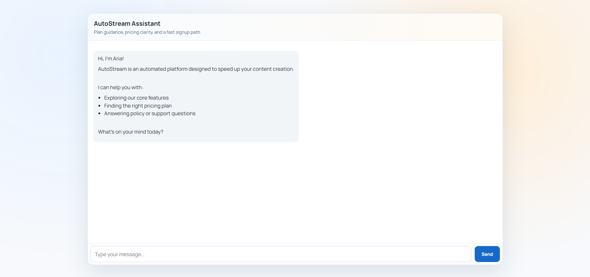

# AutoStream AI Sales Agent

AutoStream AI Sales Agent is a conversational assistant for AutoStream product Q&A, plan guidance, FAQ handling, and lead qualification. It uses LangGraph for conversation flow, Gemini for generation, and a local knowledge base for grounded answers.

## What It Does

| Capability | Implementation |
|---|---|
| CLI chat assistant | Interactive terminal session in [main.py](main.py) |
| Web chat API | FastAPI app in [api.py](api.py) with `/`, `/chat`, `/health`, `/history`, `/debug`, and `/reset` |
| Intent detection | Heuristic classifier in [tools.py](tools.py) |
| Knowledge retrieval | Local RAG over [knowledge_base/autostream_kb.json](knowledge_base/autostream_kb.json) via [rag.py](rag.py) |
| Lead qualification | Stateful `name -> email -> platform` collection and mock lead capture in [agent.py](agent.py) and [tools.py](tools.py) |
| Semantic fallback | FAISS + sentence-transformers in [vector_store.py](vector_store.py), with keyword fallback if needed |
| UI | Browser chat template in [templates/index.html](templates/index.html) |
| Evaluation | Small intent-classification check in [evaluate.py](evaluate.py) |

## Project Structure

```text
autostream-agent/
|- agent.py
|- api.py
|- evaluate.py
|- main.py
|- rag.py
|- tools.py
|- vector_store.py
|- knowledge_base/
|  |- autostream_kb.json
|- templates/
|  |- index.html
|- requirements.txt
|- README.md
```

## Requirements

- Python 3.10 or newer
- A valid Gemini API key in `GOOGLE_API_KEY`
- Optional: `GOOGLE_MODEL` to override the default model name

The first run may download the sentence-transformer model used by the vector store.

## How To Run

### 1. Create a virtual environment

Windows PowerShell:

```powershell
python -m venv venv
.\venv\Scripts\Activate.ps1
```

macOS / Linux:

```bash
python -m venv venv
source venv/bin/activate
```

### 2. Install dependencies

```bash
pip install -r requirements.txt
```

### 3. Set your Gemini API key

Windows PowerShell:

```powershell
$env:GOOGLE_API_KEY="your-google-api-key"
```

Windows CMD:

```cmd
set GOOGLE_API_KEY=your-google-api-key
```

macOS / Linux:

```bash
export GOOGLE_API_KEY=your-google-api-key
```


Optional model override:

```powershell
$env:GOOGLE_MODEL="gemini-2.5-flash-lite"
```

### 4. Run the terminal assistant

```bash
python main.py
```

This opens an interactive chat session with Aria in your terminal. Type `help` for commands and `exit` to quit.

### 5. Run the web app

```bash
uvicorn api:app --reload
```

Then open `http://127.0.0.1:8000` in your browser.

## Web Interface



## Example Usage

Terminal chat:

```text
You > What does the Pro plan include?
Aria > ...
```

Web API:

```bash
curl -X POST http://127.0.0.1:8000/chat ^
	-H "Content-Type: application/json" ^
	-d "{\"user_id\":\"demo\",\"message\":\"What is the refund policy?\"}"
```

## Behavior Overview

- The agent answers from the AutoStream knowledge base and its defined routing logic.
- Product and policy responses are grounded in the local JSON knowledge base.
- When a user shows buying intent, the agent collects `name`, `email`, and `platform` before calling the mock lead capture tool.
- The FastAPI app keeps per-user session state in memory, applies basic rate limiting, and exposes health/debug endpoints.

## Notes

- [tools.py](tools.py) contains the mock lead capture function and intent heuristics.
- [rag.py](rag.py) handles knowledge-base loading and retrieval.
- [vector_store.py](vector_store.py) provides semantic search support using FAISS.
- [templates/index.html](templates/index.html) powers the simple browser UI served by FastAPI.
- [evaluate.py](evaluate.py) runs a small heuristic intent check for quick sanity testing.

